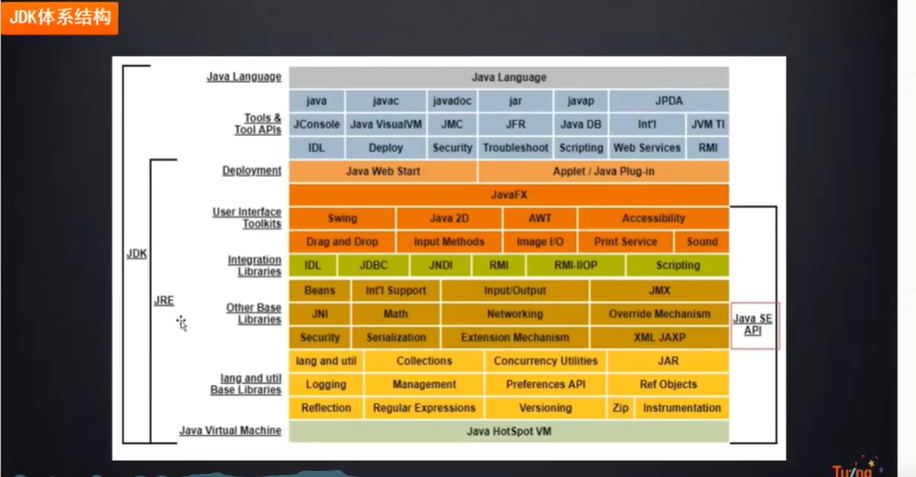

# JVM体系结构

跨平台

JVM从软件层面屏蔽了不同操作系统在底层硬件与指令上的区别

# Java虚拟机内部组成结构

java虚拟机内部组成三大部分： 类加载子系统，运行时数据区，字节码执行引擎

堆：new出来的对象

栈：（线程栈）线程运行过程中的变量(内部类，局部变量等)，主要由一系列的栈帧组成，线程执行的每个方法都会分配到一块内存区域（栈帧内存区域）。

共同点：先进后出
局部变量表
动态链接
操作数栈
方法出口

# 局部变量，动态链接，操作数栈，方法出口

